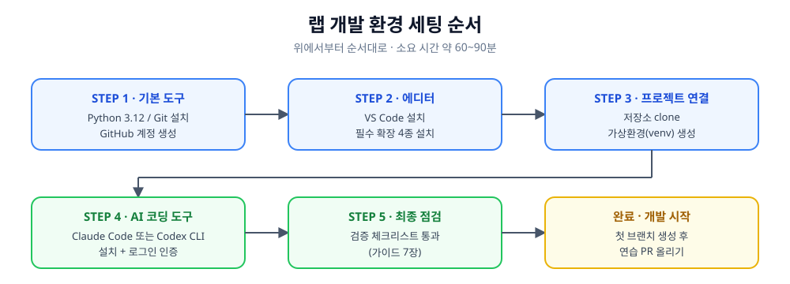
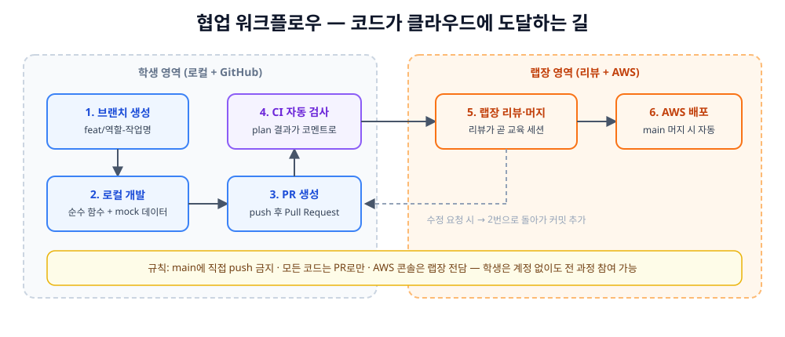

# 랩 개발 환경 세팅 가이드

> **대상**: 개발 환경을 처음 세팅하는 랩 멤버 (코딩 경험 무관)
> **목표**: 이 문서 하나로 Python, Git, VS Code, AI 코딩 도구까지 설치를 끝내는 것
> **소요 시간**: 약 60~90분
> **막히면**: 각 단계의 "문제 해결" 부분 확인 → 그래도 안 되면 랩 채널에 에러 메시지 전문과 함께 질문할 것



---

## 0. 시작 전 확인

- 준비물: 본인 노트북 (Windows 10/11 또는 macOS), GitHub 계정으로 쓸 이메일
- 이 가이드의 명령어는 **터미널**에 입력하는 것임
  - Windows: 시작 메뉴에서 `PowerShell` 검색 후 실행
  - macOS: Spotlight(⌘+Space)에서 `터미널` 검색 후 실행
- 명령어 입력 후 Enter를 누르면 실행됨 — 에러가 나면 메시지를 지우지 말고 그대로 복사해둘 것 (질문할 때 필요함)

---

## 1. STEP 1 — 기본 도구: Python, Git, GitHub

### 1-1. Python 3.12 설치

- 프로젝트 표준 버전은 **3.12**임 (운영 환경과 동일 버전 — 버전이 다르면 "내 컴퓨터에선 되는데" 문제가 생김)

**Windows**

- https://www.python.org/downloads/ 에서 Python 3.12.x 설치 파일 다운로드
- 설치 첫 화면에서 **"Add python.exe to PATH" 체크박스를 반드시 체크**할 것 — 이걸 놓치는 것이 Windows 세팅 문제의 절반임
- 설치 후 PowerShell을 새로 열고 확인:

```powershell
python --version
# Python 3.12.x 가 출력되면 성공
```

**macOS**

```bash
# Homebrew가 없다면 먼저 설치 (brew.sh 안내 참고)
brew install python@3.12
python3.12 --version
```

### 1-2. Git 설치

**Windows**

- https://git-scm.com/download/win 에서 설치 파일 다운로드
- 설치 중 옵션은 전부 기본값으로 Next 눌러도 무방함

**macOS**

```bash
git --version
# 없다고 나오면 안내에 따라 설치되고, 버전이 나오면 이미 설치된 것
```

### 1-3. Git 최초 설정 (전원 필수)

```bash
git config --global user.name "본인 영문 이름"
git config --global user.email "GitHub 가입 이메일"
```

- 이 이름과 이메일이 모든 커밋에 기록됨 — GitHub 가입 이메일과 반드시 일치시킬 것

### 1-4. GitHub 계정

- https://github.com 에서 계정 생성 (학교 이메일 권장 — 학생 혜택 신청 가능)
- 생성한 GitHub 아이디를 랩 채널에 공유하면 랩장이 저장소 초대를 보냄
- 초대 수락 후 저장소 접근 확인

---

## 2. STEP 2 — VS Code 설치와 설정

### 2-1. 설치

- https://code.visualstudio.com 에서 다운로드 후 설치
- Windows 설치 중 "Code로 열기 작업을 탐색기 상황 메뉴에 추가" 체크 권장 — 폴더 우클릭으로 바로 열 수 있어 편함

### 2-2. 필수 확장 4종 설치

- VS Code 왼쪽 사이드바의 **확장(Extensions) 아이콘**(네모 4개 모양) 클릭 → 검색 → Install

| 확장 이름 | 만든 곳 | 용도 |
|---|---|---|
| **Python** | Microsoft | Python 실행·디버깅의 기본 |
| **Pylance** | Microsoft | 코드 자동완성·오류 밑줄 (Python 설치 시 대개 함께 설치됨) |
| **GitLens** | GitKraken | 코드 한 줄마다 누가 언제 수정했는지 표시 |
| **GitHub Pull Requests** | GitHub | VS Code 안에서 PR 생성·리뷰 확인 |

- 선택 확장: **Jupyter** (Microsoft) — 역할 3(리스크 엔진) 담당자는 데이터 탐색용으로 설치 권장

### 2-3. 기본 설정 2가지

- `Ctrl+,` (macOS: `⌘+,`)로 설정 열기 → 검색창에 입력해서 변경:
  - `Format On Save` 검색 → **체크** (저장할 때 코드 자동 정리)
  - `Auto Save` 검색 → `afterDelay`로 변경 (저장 깜빡임 방지)

### 2-4. 터미널이 VS Code 안에 있음

- `` Ctrl+` `` (백틱, 숫자 1 왼쪽 키)를 누르면 VS Code 하단에 터미널이 열림
- 이후 모든 명령어는 여기에 입력하면 됨 — 별도 터미널 창을 오갈 필요 없음

---

## 3. STEP 3 — 프로젝트 연결: 저장소 clone과 가상환경

### 3-1. 저장소 받기 (clone)

```bash
# 프로젝트를 둘 폴더로 이동 (예시)
cd Documents

# 저장소 복제 — 주소는 랩 채널 공지의 실제 주소로 교체
git clone https://github.com/<랩저장소주소>.git
cd <저장소폴더명>

# VS Code로 열기
code .
```

### 3-2. 가상환경(venv) 생성 — 반드시 할 것

- 가상환경 = 이 프로젝트만의 독립된 Python 패키지 공간임
- 프로젝트마다 필요한 패키지 버전이 달라서, 전역에 설치하면 언젠가 서로 충돌함 — 격리가 답인 것

```bash
# 저장소 폴더 안에서 실행
# Windows (PowerShell)
python -m venv .venv
.venv\Scripts\Activate.ps1

# macOS
python3.12 -m venv .venv
source .venv/bin/activate
```

- 활성화되면 터미널 줄 맨 앞에 `(.venv)`가 표시됨 — **이 표시가 없으면 패키지 설치·실행 금지**
- Windows에서 `실행할 수 없습니다... 스크립트` 에러가 나면 PowerShell에서 아래 한 번 실행 후 재시도:

```powershell
Set-ExecutionPolicy -ExecutionPolicy RemoteSigned -Scope CurrentUser
```

### 3-3. 패키지 설치

```bash
pip install -r requirements.txt
```

- 우리 저장소의 requirements.txt는 정확한 버전(`==`)으로 고정되어 있음 — 임의로 버전을 바꾸거나 `>=`로 풀지 말 것 (버전을 열어두면 사람마다 다른 환경이 만들어져 "나만 안 되는" 버그가 생김)

### 3-4. VS Code에 가상환경 연결

- `Ctrl+Shift+P` → `Python: Select Interpreter` 입력 → `.venv` 가 붙은 항목 선택
- 이후 VS Code가 자동으로 이 가상환경을 사용함

---

## 4. STEP 4 — AI 코딩 도구 세팅

### 4-0. 공통 준비물: Node.js

- Claude Code와 Codex CLI 모두 npm(Node.js의 패키지 관리자)으로 설치하는 것이 가장 무난함
- https://nodejs.org 에서 **LTS 버전(22.x)** 설치 (Codex가 Node 22 이상을 요구하므로 22로 통일)
- 설치 확인:

```bash
node --version   # v22.x.x
npm --version
```

### 4-1. Claude Code 설치 (Anthropic)

- 터미널에서 대화하며 코드를 작성·수정해주는 AI 코딩 에이전트임

**설치 (모든 OS 공통, npm 방식)**

```bash
npm install -g @anthropic-ai/claude-code
```

- Windows에서 npm 방식이 번거로우면 PowerShell 네이티브 설치도 가능함:

```powershell
irm https://claude.ai/install.ps1 | iex
```

**로그인 및 시작**

```bash
# 프로젝트 폴더에서
claude
```

- 첫 실행 시 브라우저가 열리며 로그인 진행 — Claude 계정(구독) 또는 Anthropic API 키로 인증
- 로그인 방식은 랩 공지에 따를 것 (계정 정책 확정 후 안내)

**첫 사용 루틴**

```text
> /init          # 프로젝트 구조를 분석해 CLAUDE.md 가이드 파일 생성
> 이 프로젝트 구조를 요약해줘
```

- 공식 문서: https://code.claude.com/docs

### 4-2. Codex CLI 설치 (OpenAI)

**설치**

```bash
npm install -g @openai/codex
```

- **주의: 패키지 이름의 `@openai/`를 빠뜨리지 말 것** — `npm i -g codex`는 이름만 같은 전혀 다른 옛날 패키지가 설치되는 가장 흔한 실수임
- macOS는 `brew install --cask codex`, Windows는 아래 스크립트 설치도 가능:

```powershell
powershell -ExecutionPolicy ByPass -c "irm https://chatgpt.com/codex/install.ps1 | iex"
```

**로그인 및 시작**

```bash
codex
```

- 첫 실행 시 인증 진행 — ChatGPT 유료 계정(Plus 등) 로그인 또는 OpenAI API 키 중 선택
- 설정 파일 위치: `~/.codex/config.toml`
- 공식 저장소: https://github.com/openai/codex

### 4-3. 무엇을 쓰면 되는가

- 랩 표준은 **Claude Code**임 (랩장의 레퍼런스 프로젝트가 Claude 기반이고, 리뷰·트러블슈팅 지원이 용이함)
- Codex는 본인이 ChatGPT 유료 구독이 이미 있는 경우의 대안임 — 둘 다 설치할 필요는 없음
- 도구가 무엇이든 아래 4-4의 규칙은 동일하게 적용됨

### 4-4. AI 코딩 도구 사용 규칙 (랩 규칙)

- **설명 못 하는 코드는 제출하지 않는 것** — AI가 짠 코드라도 PR을 올린 사람이 모든 줄을 설명할 수 있어야 함. 리뷰에서 "이 줄은 왜 이렇게 했나요"에 답하지 못하면 되돌려보냄
- **AI에게 시킬 일과 직접 할 일의 구분**: 반복 코드 생성, 테스트 작성, 에러 해석, 코드 설명 요청은 적극 활용 / 데이터 계약(스키마) 변경, 모듈 인터페이스 설계 같은 팀 합의 사항은 AI가 아니라 미팅에서 결정하는 것
- **비밀값 절대 입력 금지**: API 키, 계정 정보 등을 AI 도구 대화에 붙여넣지 말 것 — 애초에 학생 저장소에는 비밀값이 없도록 설계되어 있으니, 뭔가 키가 필요해 보이면 그건 랩장에게 물어볼 신호임
- **작게 시키고 자주 검토할 것**: "전체 모듈 다 짜줘"보다 "이 함수 하나"가 품질도 학습 효과도 좋음

---

## 5. 협업 워크플로우 요약



- 모든 코드는 **브랜치 → PR → CI 자동 검사 → 랩장 리뷰 → 머지** 순서로만 main에 들어감
- main 브랜치에 직접 push하는 것은 설정으로 차단되어 있음
- 브랜치 이름 규칙: `feat/역할-작업명` (예: `feat/onchain-price-collector`)
- 커밋 메시지·PR 작성 규칙은 저장소의 CONTRIBUTING.md 참고

---

## 6. 최종 검증 체크리스트

아래 명령이 전부 정상 출력되면 세팅 완료임 — 결과 화면을 캡처해 랩 채널 세팅 완료 스레드에 올릴 것

```bash
python --version        # Python 3.12.x  (macOS는 python3.12 --version)
git --version           # git version 2.x
node --version          # v22.x
git config user.name    # 본인 이름 출력
claude --version        # 버전 출력 (Codex 사용자는 codex --version)
```

- 추가 확인: 랩 저장소를 clone했고, `.venv` 활성화 상태에서 `pip install -r requirements.txt`가 에러 없이 끝났는가
- VS Code 하단 상태바에 `.venv` 인터프리터가 표시되는가

---

## 7. 자주 겪는 문제

| 증상 | 원인과 해결 |
|---|---|
| `python` 입력 시 "명령을 찾을 수 없음" | 설치 시 PATH 체크를 놓친 것 — Python 재설치하며 "Add to PATH" 체크, 또는 macOS는 `python3.12`로 입력 |
| Windows에서 venv 활성화 시 스크립트 실행 오류 | 3-2의 `Set-ExecutionPolicy` 명령 실행 후 PowerShell 재시작 |
| `npm install -g` 중 권한(EACCES) 오류 | **sudo로 재시도하지 말 것** — npm 전역 폴더를 홈 디렉토리로 옮기는 것이 정석 (`npm config set prefix '~/.npm-global'` 후 PATH에 추가) |
| 설치는 됐는데 `claude`/`codex` 명령을 못 찾음 | 터미널을 완전히 껐다 다시 열 것 — PATH는 새 터미널부터 적용됨 |
| `pip install` 이 매우 느리거나 실패 | 학교 와이파이 방화벽 문제일 수 있음 — 핫스팟으로 재시도 후 랩 채널에 보고 |
| VS Code가 패키지를 못 찾는다고 밑줄 표시 | 3-4의 인터프리터 선택이 안 된 것 — `.venv` 인터프리터 재선택 |

- 위 표에 없는 문제는 **에러 메시지 전문 + 실행한 명령어 + OS 종류**를 함께 랩 채널에 올릴 것 — "안 돼요"만으로는 아무도 도울 수 없음
